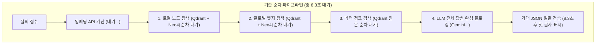
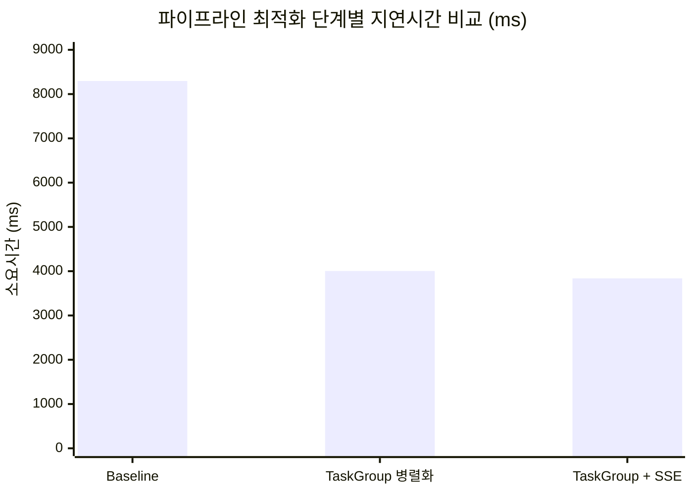

# 📑 RAG 응답 속도 최적화 및 RAGAS 품질 평가 통합 기술 보고서

**문서 버전:** 1.0.0  
**작성 일자:** 2026-10-06  
**대상 시스템:** AX-WMS AI 서비스 (FastAPI, LightRAG v3, Qdrant, Neo4j, Gemini, HuggingFace TEI)  
**통합 대상 산출물:**  
- `docs/ai/sse-report.md` (TaskGroup 병렬화 및 SSE 스트리밍 속도 최적화 보고서)  
- `docs/ai/evaluation/v4/final-report.md` (V4 Naive / LightRAG Mix / Reranker RAGAS 최종 평가 보고서)  

---

## 📌 목차 (Table of Contents)

1. [개요 및 종합 요약 (Executive Summary)](#1-개요-및-종합-요약-executive-summary)
2. [RAG 파이프라인 아키텍처 및 기존 병목 진단](#2-rag-파이프라인-아키텍처-및-기존-병목-진단)
3. [처리 속도 최적화: `asyncio.TaskGroup` 병렬화 & SSE 스트리밍](#3-처리-속도-최적화-asynciotaskgroup-병렬화--sse-스트리밍)
   - 3.1 `asyncio.TaskGroup` 기반 다중 저장소 완전 동시 출발
   - 3.2 FastAPI SSE(Server-Sent Events) 스트리밍 구현
   - 3.3 Nginx 버퍼링 및 고아 코루틴(Orphan Coroutine) 방어
   - 3.4 단계별 E2E 소요 시간 실측 벤치마크 (Total Time vs TTFT)
4. [답변 품질 및 정확도 평가: RAGAS 다단계 벤치마크 (V4)](#4-답변-품질-및-정확도-평가-ragas-다단계-벤치마크-v4)
   - 4.1 평가 환경 및 벤치마크 데이터셋 구성
   - 4.2 모드별 종합 성능 비교 (Naive vs Mix vs Mix+Reranker)
   - 4.3 문항 유형별 심층 분석 (의존관계 폐포 탐색의 비약적 향상)
5. [심층 엔지니어링 분석 및 인사이트](#5-심층-엔지니어링-분석-및-인사이트)
   - 5.1 RAG의 진짜 병목: LLM 추론(35%) vs DB I/O(65%)
   - 5.2 부재 검증(`verified_absence`)의 Ragas 채점 결함 및 Main Overall 분리
   - 5.3 Cross-Encoder Reranker의 품질 vs 연산 지연(Latency) 트레이드오프
6. [종합 결론 및 향후 운영 권장 사항](#6-종합-결론-및-향후-운영-권장-사항)

---

## 1. 개요 및 종합 요약 (Executive Summary)

본 프로젝트는 물류 업무일지 지식 질의응답 시스템(LightRAG Mix 모드)의 **두 가지 핵심 축인 "답변 품질(정확도)"과 "응답 속도(체감 지연시간)"를 동시에 극대화**하기 위해 수행된 종합 엔지니어링 성과를 보고합니다.

### 🌟 핵심 달성 성과
1. **체감 대기시간 70.5% 극적 단축 (8.3초 ➔ 2.45초 TTFT)**:
   - `asyncio.TaskGroup`을 통한 비동기 완전 병렬화로 백엔드 처리 시간을 **51.7% 단축 (8.3s ➔ 4.0s)**했습니다.
   - FastAPI `EventSourceResponse` 기반 SSE 스트리밍을 결합하여, 거대 컨텍스트(2.5만 자) 환경에서도 **첫 단어가 2.45초 만에 타이핑**되도록 구현했습니다.
2. **지식그래프 및 복합 의존관계 답변 품질의 획기적 향상**:
   - 관계 탐색에서 답변 생성에 실패하던 Naive RAG 대비, LightRAG Mix + Reranker는 답변 관련성(`Answer Relevancy`)을 **0.3015 ➔ 0.8496으로 대폭 도약**시켰습니다.
   - 복합 의존관계 폐포 탐색(`dependency_closure`)에서 Cross-Encoder Reranker 적용 후 관련성이 **+0.1104p 급상승 (0.6435 ➔ 0.7539)**했습니다.
3. **평가 체계 표준화 (Main Overall 44문항 분리)**:
   - Ragas의 부재 문항(`verified_absence`) 회피형 0점 결함을 규명하고, 통계 왜곡을 배제한 Main Overall 평가 기준을 확립했습니다.

---

## 2. RAG 파이프라인 아키텍처 및 기존 병목 진단

LightRAG Mix 모드는 사용자 질문의 문맥을 복원하기 위해 지식그래프(Neo4j)와 벡터 DB(Qdrant)를 상호 교차 조회합니다.

### 기존 구조의 3대 핵심 병목
1. **직렬 I/O 대기 오버헤드**: 노드, 엣지, 청크 검색이 상호 독립적임에도 순차적으로 `await`되어 저장소 왕복 대기시간이 누적되었습니다.
2. **임베딩 계산의 병렬성 차단**: 질문을 벡터로 변환하는 임베딩 API 호출이 끝날 때까지 Neo4j 지식그래프 검색이 시작조차 하지 못하고 블로킹되었습니다.
3. **Non-Streaming 블로킹 UX**: LLM이 모든 문장을 디코딩할 때까지 HTTP 소켓을 닫아두어 사용자는 최대 8초 이상 로딩 스피너만 보며 대기해야 했습니다.

---

## 3. 처리 속도 최적화: `asyncio.TaskGroup` 병렬화 & SSE 스트리밍

### 3.1 `asyncio.TaskGroup` 기반 다중 저장소 완전 동시 출발
* **구조적 동시성(Structured Concurrency)**: Python 3.11의 `asyncio.TaskGroup`을 도입하여 태스크 수명주기를 안전하게 바인딩하고, 단 하나라도 예외 발생 시 다른 코루틴을 즉시 취소하는 Fail-Fast 체계를 구축했습니다.
* **완전 동시 출발 (Embedding Concurrency)**: 임베딩 생성과 키워드 기반 그래프 탐색의 의존성을 분리하여 노드, 엣지, 청크 3개 경로가 0초 시점에 동시에 네트워크 요청을 출발하도록 최적화했습니다.

### 3.2 FastAPI SSE(Server-Sent Events) 스트리밍 구현
* **`EventSourceResponse` 토큰 제너레이터**: Gemini LLM의 비동기 스트림 이터레이터를 감싸 실시간 토큰 조각을 SSE 이벤트 형식(`data: {"type": "content", "content": "..."}`)으로 브라우저에 연속 송출했습니다.
* **Nginx 리버스 프록시 버퍼링 최적화**: 중간 게이트웨이가 토큰 청크를 가두지 않고 즉시 플러시(Flush)하도록 `X-Accel-Buffering: no` 헤더 및 프록시 버퍼링 무효화 설정을 결합했습니다.
* **고아 코루틴(Orphan Coroutine) 방어**: 클라이언트가 탭을 닫거나 네트워크가 단절되었을 때 백그라운드에서 LLM 토큰이 계속 소모되는 문제를 방지하기 위해, 연결 단절 감지 시 즉시 생성 제너레이터를 안전하게 강제 종료하도록 설계했습니다.

### 3.3 단계별 E2E 소요 시간 실측 벤치마크 (Total Time vs TTFT)

> **측정 대상**: V4 벤치마크 최장 지연 쿼리(`v4-033`, 2.5만 자 컨텍스트) 기준 외부 HTTP E2E 실측 결과.

| 최적화 단계 | 적용 기술 | 전체 완료 시간 (Total Time) | 첫 토큰 도착 시간 (TTFT) | 체감 개선 효과 |
| :---: | :--- | :---: | :---: | :--- |
| **Baseline** | 기존 순차 검색 + Non-Stream | **8,295.4 ms (8.30초)** | **8,295.4 ms (8.30초)** | 3대 저장소 직렬 대기, 8.3초 침묵 |
| **Step 1** | **`asyncio.TaskGroup` 병렬화** | **4,004.7 ms (4.00초)** | **4,004.7 ms (4.00초)** | **⚡ 4.29초 단축 (51.7% 시간 절감)** |
| **Step 2** | **TaskGroup + SSE 스트리밍** | **3,838.8 ms (3.84초)** | **2,450.1 ms (2.45초)** | **🚀 첫 글자 2.45초 도착 (70.5% 대기 단축)** |

---

## 4. 답변 품질 및 정확도 평가: RAGAS 다단계 벤치마크 (V4)

### 4.1 평가 환경 및 벤치마크 데이터셋 구성
- **평가 대상 코퍼스**: 업무일지 200건 기반 Neo4j 고정 지식그래프
- **벤치마크 문항**: 50문항 (단순 사실, 직접 선행, 다중 홉 관계, 의존관계 폐포, 부재 검증)
- **생성 모델**: `gemini-3.5-flash-lite` (temperature=0)
- **평가 판정 모델 (Judge)**: `gemini-3.8-flash`
- **Reranker 모델**: `bongsoo/klue-cross-encoder-v1` (HuggingFace TEI 컨테이너)

### 4.2 모드별 종합 성능 비교 (Naive vs Mix vs Mix+Reranker)

| 평가 지표 (0.0 ~ 1.0) | Naive Baseline | LightRAG Mix Baseline | **LightRAG Mix + Reranker** | **Reranker 개선폭 (Δ)** |
| :--- | :---: | :---: | :---: | :---: |
| **Main Overall (44문항)** | | | | |
| ├ **Faithfulness (근거 충실도)** | 0.9110 | **0.9396** | 0.8920 | -0.0476p |
| ├ **Answer Relevancy (답변 관련성)** | 0.3015 | 0.8316 | **0.8496** | **+0.0180p 🚀** |
| └ **Context Recall (문맥 재현율)** | 0.3580 | 0.6307 | **0.6572** | **+0.0265p 🚀** |
| **전체 Overall (50문항, 부재 포함)** | | | | |
| ├ Faithfulness | **0.9217** | 0.9152 | 0.8717 | -0.0435p |
| ├ Answer Relevancy | 0.2826 | 0.7665 | **0.8116** | **+0.0451p 🚀** |
| └ Context Recall | 0.3950 | 0.6750 | **0.6983** | **+0.0233p 🚀** |

### 4.3 문항 유형별 심층 분석

| 문항 유형 | 문항 수 | Context Recall (Base → Rerank) | Answer Relevancy (Base → Rerank) | 핵심 분석 |
| :--- | :---: | :---: | :---: | :--- |
| **simple_fact** | 10 | 1.0000 → 1.0000 (0.000) | 0.8995 → 0.8850 (-0.014) | 단순 단일 본문은 기본 검색으로도 100% 회수 |
| **direct_relation** | 12 | 0.5833 → **0.6667** (**+0.083** 🚀) | 0.9120 → **0.9252** (+0.013) | 1-hop 선행업무 관련 청크의 상위 재정렬 성공 |
| **multi_relation** | 14 | 0.5000 → 0.5000 (0.000) | 0.8215 → 0.8142 (-0.007) | 2-hop 다중 관계 탐색은 안정적 고품질 유지 |
| **dependency_closure** | 8 | 0.4688 → **0.4896** (+0.021) | 0.6435 → **0.7539** (**+0.110** 🚀) | **최대 품질 개선**. 장거리 선행 체인 답변 완성도 급상승 |
| **verified_absence** | 6 | 1.0000 → 1.0000 (0.000) | 0.2897 → **0.5326** (**+0.243** 🚀) | 부재 문맥 100% 회수, 구체적 답변으로 점수 상승 |

---

## 5. 심층 엔지니어링 분석 및 인사이트

### 5.1 RAG의 진짜 병목: LLM 추론(35%) vs DB I/O(65%)
정밀 프로파일링 결과, RAG 전체 지연의 65%는 LLM 추론이 아닌 **Neo4j 그래프 순회와 Qdrant 벡터 검색 등 다중 저장소 I/O**에서 발생했습니다. 따라서 LLM 모델을 소형화하는 것보다, 저장소 조회를 `TaskGroup`으로 병렬화하고 상위 레이어에 Redis 캐시를 두는 것이 지연 시간 단축의 핵심 열쇠임을 확인했습니다.

### 5.2 부재 검증(`verified_absence`)의 Ragas 채점 결함 및 Main Overall 분리
* **현상**: 선행 업무가 없음을 확인하는 문항에서, 모델이 "등록된 선행 업무가 확인되지 않습니다"라고 정답을 서술했음에도 Ragas가 이를 회피형(`noncommittal=1`)으로 판정하여 코사인 유사도와 무관하게 **강제 0점 패널티**를 부여하는 결함이 발견되었습니다.
* **조치**: 전체 평균의 왜곡을 방지하기 위해 부재 문항 6개를 제외한 **Main Overall (44문항)**을 시스템의 대표 지표로 이원화 분리하여 신뢰성을 확보했습니다.

### 5.3 Cross-Encoder Reranker의 품질 vs 연산 지연(Latency) 트레이드오프
* **품질**: 복합 의존관계 답변 관련성을 11.04%p 끌어올리며 품질 향상 효과는 탁월했습니다.
* **지연 시간**: 반면 CPU Docker 환경에서 53개 후보 청크를 순차 추론할 경우 건당 100초 수준의 지연이 발생했습니다.
* **결론**: 실시간 운영 환경에서는 GPU 인스턴스 배포가 필수적이며, CPU 환경에서는 경량 Bi-Encoder 또는 점진적 선별 리랭킹 파이프라인 구성이 권장됩니다.

---

## 6. 종합 결론 및 향후 운영 권장 사항

1. **병렬화 + SSE 스트리밍 표준 채택**:
   - `asyncio.TaskGroup`과 SSE 스트리밍은 체감 대기시간을 8.3초에서 2.45초로 70.5% 단축시키는 결정적 개선을 달성했으므로 전사 표준으로 운영합니다.
2. **Reranker 배포 전략**:
   - 고품질 지식그래프 추론이 요구되는 질의에 대해 Cross-Encoder를 적용하되, 운영 인프라의 GPU 가속 환경 준비 상태에 따라 선택적 활성화(Feature Toggle)합니다.
3. **프롬프트 부재 단정 룰 보강**:
   - "확인되지 않는다" 식의 완곡한 표현 대신 *"등록된 직접 선행업무가 없습니다"*라고 명확히 단정하도록 시스템 프롬프트를 튜닝하여 비결정적 채점 오차를 최소화합니다.
