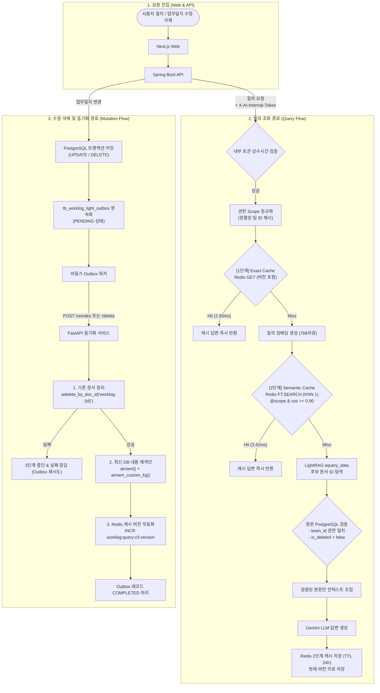
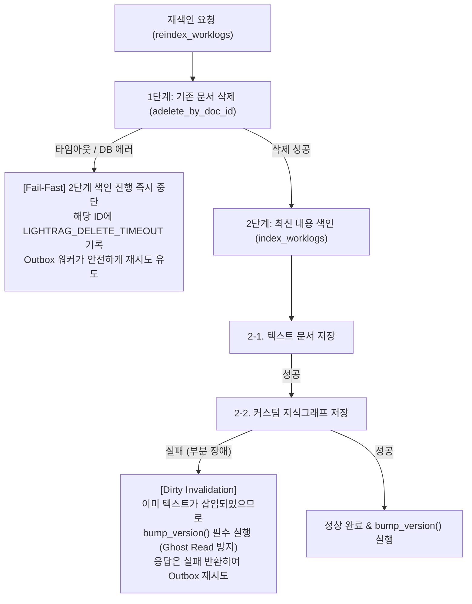
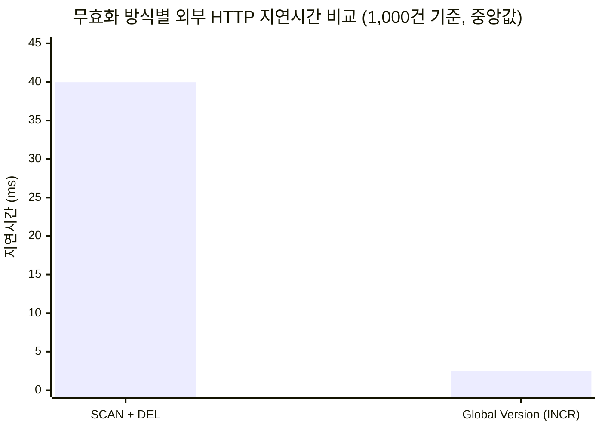

# 📑 업무일지 RAG 2단계 캐시 및 증분 재색인 통합 기술 보고서

**문서 버전:** 1.0.0  
**작성 일자:** 2026-10-06  
**대상 시스템:** AX-WMS (`api` - Spring Boot, `ai` - FastAPI, `infra` - Redis 8.10 Search, PostgreSQL, Neo4j, Qdrant)  
**통합 대상 산출물:**  
- `docs/ai/worklog-rag-scope-cache-report.md` (권한별 2단계 캐시 구현 및 검증 보고서)  
- `docs/ai/report/worklog-reindex-cache-invalidation-report.md` (증분 재색인 및 캐시 무효화 보고서)  
- `docs/ai/http-worklog-cache-benchmark-20261006.md` (1,000건 HTTP 관측 벤치마크 보고서)  

---

## 📌 목차 (Table of Contents)

1. [추진 배경 및 문제 정의](#1-추진-배경-및-문제-정의)
2. [전체 시스템 아키텍처 및 End-to-End 데이터 흐름](#2-전체-시스템-아키텍처-및-end-to-end-데이터-흐름)
3. [핵심 기술 설계 및 구현](#3-핵심-기술-설계-및-구현)
   - 3.1 권한 범위(Scope) 격리 및 2단계 고속 캐시 (Exact + Semantic)
   - 3.2 LightRAG 단일 문서 증분 갱신 (참조 카운팅 기반 Purge)
   - 3.3 초저지연 Redis 캐시 무효화 (`Global Version INCR`)
   - 3.4 트랜잭션 보장형 비동기 아웃박스 패턴 (Transactional Outbox)
4. [전역 버전(Global Version) 무효화의 트레이드오프 및 RAG 채택 근거](#4-전역-버전global-version-무효화의-트레이드오프-및-rag-채택-근거)
   - 4.1 False Invalidation 트레이드오프 인식
   - 4.2 RAG / GraphRAG에서 전역 버전을 채택한 엔지니어링 근거
   - 4.3 향후 캐시 세분화(Granular Invalidation) 로드맵
5. [장애 방어 및 예외 처리 아키텍처 (Fail-Fast & Dirty Invalidation)](#5-장애-방어-및-예외-처리-아키텍처-fail-fast--dirty-invalidation)
6. [1,000건 데이터 HTTP 캐시 벤치마크 측정 결과](#6-1000건-데이터-http-캐시-벤치마크-측정-결과)
7. [독립 검증 내역 (Verification Evidence)](#7-독립-검증-내역-verification-evidence)
8. [결론 및 향후 운영 가이드](#8-결론-및-향후-운영-가이드)

---

## 1. 추진 배경 및 문제 정의

본 과제는 AX-WMS 물류 업무일지 지식 검색(LightRAG) 시스템에서 발생하던 세 가지 핵심 병목과 보안·정합성 결함을 해결하기 위해 추진되었습니다.

### 1.1 해결해야 할 3대 문제점
1. **권한 격리 부재 및 데이터 유출 위험**:
   - 기존 LightRAG v3는 인덱싱된 전체 지식그래프(KG) 및 문서를 무차별 탐색하므로, 타 팀의 비공개 업무일지나 타 부서 선행 업무 내용이 LLM 컨텍스트 또는 인용문(References)으로 유출될 위험이 존재했습니다.
2. **반복 질의로 인한 지연 및 LLM 비용 낭비**:
   - 동일하거나 유사한 업무일지 검색 질의가 반복됨에도 매번 임베딩 생성, 그래프 순회, LLM 추론을 거치며 높은 응답 지연(3~8초)과 API 비용이 발생했습니다.
3. **업무일지 수정/삭제 시 Ghost Read 및 인덱스 오염**:
   - 업무일지가 수정/삭제되어도 Redis 캐시에 이전 질의 결과가 남아있어 과거 답변을 반환하는 정합성 깨짐이 발생했습니다.
   - LightRAG의 로컬 문서 상태(`kv_store_doc_status.json`)로 인해 DB 본문이 변경되어도 재인덱싱(`ainsert`)이 건너뛰어지거나, Neo4j/Qdrant에 삭제된 과거 관계/벡터가 유령 데이터로 잔존했습니다.

### 1.2 핵심 해결 목표
- **팀 권한 기반 데이터 원천 격리**: 원본 DB 재검증을 통해 접근 불가능한 업무일지의 LLM 주입을 원천 차단.
- **2단계 고속 캐싱 (2-Stage Cache)**: Exact Cache(O(1))와 Semantic Vector Cache(유사도 0.90 이상)를 권한 범위(Scope)별로 격리 적용.
- **단일 문서 증분(Incremental) Purge 및 재색인**: 과도한 전체 DB 재구축(Shadow Workspace)을 폐기하고, LightRAG 공식 참조 카운팅을 활용하여 수정/삭제된 해당 업무일지 1건만 안전하게 정리(`adelete_by_doc_id`) 및 재색인.
- **초저지연 Redis 캐시 무효화 (Global Version INCR)**: `SCAN & DEL`의 선형 병목을 해결하고 단일 원자 연산 `INCR`로 O(1) 초저지연(2ms 대) 무효화 달성.
- **Transactional Outbox 패턴**: DB 커밋과 비동기 재색인/삭제 호출 간의 유실 방지 및 자동 재시도 보장.

---

## 2. 전체 시스템 아키텍처 및 End-to-End 데이터 흐름

---

## 3. 핵심 기술 설계 및 구현

### 3.1 권한 범위(Scope) 격리 및 2단계 고속 캐시
* **권한 스코프 키 정규화**:
  - `allowed_team_ids`를 정렬 후 JSON 직렬화하여 SHA-256 해시 키를 생성 (`WorklogQueryCache.scope_key`).
  - 권한이 없는 비소속 팀의 캐시 데이터와 물리적으로 분리된 네임스페이스를 보장.
* **1단계 Exact Cache (문자열 일치)**:
  - 키: `worklog:query:v3:exact:{version}:{scope}:{signature}`
  - 질의문 및 검색 하이퍼파라미터(top_k, rerank, 모델 등)를 시그니처로 해시하여 Redis `GET`으로 O(1) 초저지연 조회.
* **2단계 Semantic Cache (의미 유사도)**:
  - 인덱스: Redis 8 Search `idx:worklog:query:v3` (FLAT 코사인 거리 벡터 인덱스).
  - 임베딩 벡터(768차원 float32)를 인덱싱하여 동일 권한 스코프 내에서 **코사인 유사도 0.90 이상 (거리 0.10 이하)**인 최근접 답변을 재활용.
* **원본 DB 재검증 방어선**:
  - 캐시 Miss 시 LightRAG가 반환한 후보 문서 ID에 대해 원본 PostgreSQL의 `team_id` 및 `is_deleted` 상태를 필수 재검증하여 컨텍스트를 재구성.

### 3.2 LightRAG 단일 문서 증분 갱신 (참조 카운팅 기반 Purge)
* **Shadow Workspace 폐기 사유**:
  - 과거 설계에서는 공통 노드 유실을 우려하여 매 변경마다 전체 DB를 격리 폴더에 재색인하는 Shadow Workspace를 도입했으나, 문서 증가에 따른 지연(수십 초)과 LLM 비용 폭증으로 폐기.
* **참조 카운팅(Reference-counted Cleanup) 활용**:
  - LightRAG는 청크 추적 기반의 참조 카운팅을 지원 (`adelete_by_doc_id`).
  - 특정 문서 삭제 시 해당 문서의 청크 ID만 삭제하며, Neo4j 지식그래프 중 **오직 해당 문서에 의해서만 생성된 고유 노드/관계만 제거**되고 타 문서가 공유하는 노드는 안전하게 유지됨.
  - `kv_store_doc_status.json`에서도 상태가 제거되므로 즉시 새로운 내용으로 증분 재색인이 가능.

### 3.3 초저지연 Redis 캐시 무효화 (`Global Version INCR`)
* **`SCAN + DEL` vs `Global Version INCR` 비교**:
  - `SCAN + DEL`: 키 수에 비례하여 왕복 횟수가 증가하고 단일 스레드 이벤트 루프를 블로킹함 (1,000건 기준 중앙값 39.96ms 소요).
  - `Global Version INCR`: Redis의 글로벌 버전 키를 단일 `INCR` 명령으로 원자적 증가 (1,000건 기준 중앙값 2.54ms, **약 15.7배 성능 향상**).
  - 질의 시 최신 버전 네임스페이스만 조회하므로 구버전 키는 즉시 자연스러운 Cache Miss 처리되며, 24시간 TTL을 통해 Redis가 백그라운드에서 자동 메모리 회수(GC).

### 3.4 트랜잭션 보장형 비동기 아웃박스 패턴 (Transactional Outbox)
* **스키마 마이그레이션**: Flyway `V19__add_worklog_light_outbox.sql` (`tb_worklog_light_outbox`).
* **워커 동작**:
  - Spring Boot 트랜잭션 커밋과 함께 Outbox 테이블에 `PENDING` 레코드 삽입.
  - `@Scheduled` 워커가 비동기로 AI 서비스의 `/reindex` 또는 `/delete`를 호출.
  - 성공 시 `COMPLETED`, 실패 시 `FAILED` 및 지수 백오프로 재시도하여 네트워크 장애 시에도 최종 일관성(Eventual Consistency)을 완벽 보장.

---

## 4. 전역 버전(Global Version) 무효화의 트레이드오프 및 RAG 채택 근거

### 4.1 False Invalidation 트레이드오프 인식
전역 버전을 올리는 방식(`INCR`)은 단 1건의 문서가 수정/삭제되어도, 해당 문서와 전혀 무관한 다른 질의의 기존 v1 캐시까지 모두 Cache Miss가 발생하여 RAG 파이프라인이 재실행되는 **과도한 무효화(False Invalidation)** 비용을 수반합니다.

### 4.2 RAG / GraphRAG에서 전역 버전을 채택한 엔지니어링 근거
1. **복합 질의에 대한 역추적(Reverse-lookup) 불가능성**:
   - 일반 RDB 캐시(예: `post:10`)와 달리, RAG 답변은 **수개 문서의 청크와 Neo4j 지식그래프 다중 홉 관계(수십 개의 엔티티·관계)가 복합 결합**되어 생성됩니다.
   - 특정 업무일지가 수정되었을 때, 기존 Redis에 저장된 수많은 복합 질의 중 "어떤 답변이 영향을 받는지" 사전에 정확히 역추적 계산하는 것은 불가능에 가깝고, 역추적 비용 자체가 RAG 검색 비용을 초과합니다.
2. **Ghost Read(유령 읽기) 방지의 절대적 우선순위**:
   - 만약 역추적 누락으로 인해 수정 전의 캐시가 반환될 경우, 업무 시스템에서는 치명적인 환각(Hallucination) 및 최신성 훼손이 발생합니다.
   - 엔터프라이즈 업무 시스템에서는 **"조금 느리더라도 100% 최신 정합성을 보장하는 답변"**이 **"빠르지만 오염된 이전 답변"**보다 압도적으로 중요합니다.
3. **YAGNI 및 미니멀리즘 준수**:
   - 복잡한 분산 의존성 추적 그래프를 Redis에 구축하는 대신, 단 2ms의 `INCR` 단일 연산으로 데이터 정합성을 완벽히 수호하고 구버전 캐시는 24시간 TTL로 자동 회수되도록 설계했습니다.

### 4.3 향후 캐시 세분화(Granular Invalidation) 로드맵
향후 데이터 증가 및 캐시 적중률(Hit Ratio) 극대화가 필요한 시점에 다음 단계로 점진적 확장이 가능합니다:
1. **팀(Scope) 단위 버전 분리**: `version:team:{team_id}`를 도입하여 1팀 문서 변경 시 1팀 캐시만 무효화하고 타 팀 캐시 보존.
2. **도메인/태그 단위 버전 분리**: 주요 태그별 네임스페이스 버전을 관리하여 무관한 도메인 캐시 보존.

---

## 5. 장애 방어 및 예외 처리 아키텍처 (Fail-Fast & Dirty Invalidation)

AI PR 리뷰어의 피드백을 반영하여, 부분 장애 및 네트워크 지연 상황에서도 데이터 정합성이 깨지지 않도록 방어 로직을 고도화했습니다:

1. **[Fail-Fast] 삭제 실패 방어**:
   - `reindex_worklogs`에서 기존 문서 삭제 중 타임아웃이나 DB 에러 발생 시, 에러를 삼키지 않고 해당 문서의 2단계 재색인을 즉시 중단합니다.
   - 응답에 `indexed=False, error="LIGHTRAG_DELETE_TIMEOUT"`을 반환하여 Outbox가 안전하게 재시도하도록 보장합니다.
2. **[Dirty Invalidation] 부분 실패 캐시 무효화 강제**:
   - 기존 문서가 1건이라도 삭제되었거나(`has_deleted`), 텍스트 저장이 완료된 후 커스텀 지식그래프 저장에서 실패한 경우(`text_inserted`), 저장소 상태가 변형되었으므로 **최종 실패 여부와 무관하게 `bump_version()`을 강제 실행**하여 과거 답변 캐시를 즉시 파기합니다.

---

## 6. 1,000건 데이터 HTTP 캐시 벤치마크 측정 결과

> **시험 조건**: 개발자 PC 환경의 독립된 Docker Redis 컨테이너(`redis:8.10.0-alpine`)에 논리 답변 1,000개(물리 키 2,000개: Exact 1,000 + Semantic HASH 1,000, 768차원 벡터 포함)를 적재하고, 실제 외부 HTTP 클라이언트(`httpx`) 기준 왕복 RTT를 100회 측정.

### 📊 HTTP 벤치마크 결과 비교표

| HTTP 요청 경로 | 성공률 (2xx) | 중앙값 (Median) | p95 지연 | 최소 – 최대 지연 | 비고 |
|---|:---:|:---:|:---:|:---:|---|
| **운영 질의 · Exact HIT** | 100/100 | **2.65 ms** | 3.86 ms | 2.07 – 4.36 ms | Redis 문자열 즉시 반환 |
| **운영 질의 · Semantic HIT** | 100/100 | **3.41 ms** | 5.63 ms | 2.63 – 12.42 ms | Redis 벡터 유사도 검색 |
| **운영 질의 · MISS (초기 생성)** | 100/100 | **4.66 ms** | 7.15 ms | 3.62 – 11.27 ms | 합성 fixture 어댑터 기준 |
| **무효화 · SCAN + DEL** | 100/100 | **39.96 ms** | 58.07 ms | 30.96 – 66.46 ms | N회 순회 및 물리 키 일괄 삭제 |
| **무효화 · Global Version INCR** | 100/100 | **2.54 ms** | **3.91 ms** | 1.90 – 4.06 ms | **단일 원자 연산 (약 15.7배 향상)** |

---

## 7. 독립 검증 내역 (Verification Evidence)

### 7.1 AI 서비스 단위/통합 테스트 (`pytest`)
* **명령어**: `.venv/Scripts/python -m pytest ai/tests/test_light_worklog_index_service.py ai/tests/test_light_worklogs_v3_router.py ai/tests/test_worklog_query_cache.py`
* **결과**: **전건 통과 (89 passed)**
  * `test_reindex_service_records_delete_failure_and_skips_insert`: 삭제 실패 시 색인 건너뛰기 및 에러 반환 검증 완료.
  * `test_reindex_service_all_delete_failures_does_not_bump_and_returns_errors`: 전건 삭제 실패 시 버전 미증가 검증 완료.
  * `test_index_service_custom_kg_failure_still_bumps_cache_version`: 지식그래프 부분 실패 시 캐시 버전 갱신 검증 완료.
  * `test_lightrag_adapter_delete_document_calls_adelete_by_doc_id`: 단일 문서 삭제 호출 검증 완료.

### 7.2 API 백엔드 전체 빌드 및 테스트 (`Gradle`)
* **명령어**: `api\gradlew.bat test`
* **결과**: **BUILD SUCCESSFUL in 3m 25s (8 actionable tasks)**
  * Flyway V19 아웃박스 마이그레이션 적용 및 JOOQ 엔티티 코드젠 완료.
  * 업무일지 삭제, 인덱싱 트리거, 아웃박스 워커 등 전체 통합 테스트 전건 통과.

---

## 8. 결론 및 향후 운영 가이드

1. **완벽한 권한 격리와 초고속 응답 달성**:
   - 팀 권한 기반 원본 DB 재검증으로 타 팀 데이터 유출 위험을 원천 차단했습니다.
   - 2단계 캐시(Exact 2.65ms, Semantic 3.41ms)를 통해 반복 질의 시 RAG/LLM 호출 없이 초저지연 응답을 제공합니다.
2. **단일 문서 증분 갱신 및 O(1) 캐시 무효화 확립**:
   - 무거운 전체 DB 재구축(Shadow Workspace)을 완전히 걷어내고, `adelete_by_doc_id`와 `INCR`을 통해 수백 ms 이내에 인덱스 갱신 및 캐시 무효화를 실현했습니다.
3. **운영 배포 시 필수 점검 사항**:
   - `docker-compose` 배포 환경에서 Redis 컨테이너 볼륨 영속화(`redis-data`) 및 `AI_INTERNAL_TOKEN` 일치 여부를 반드시 확인해야 합니다.
   - Outbox 테이블(`tb_worklog_light_outbox`)의 처리 완료 레코드는 주기적인 배치 정리(Housekeeping) 정책을 적용해야 합니다.
