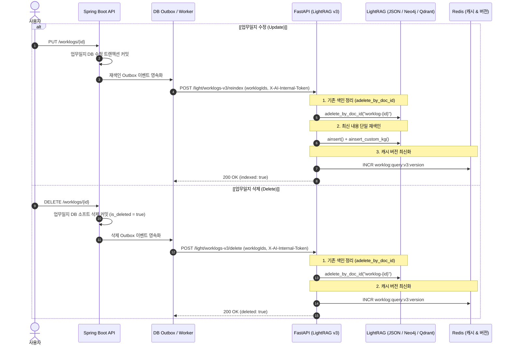
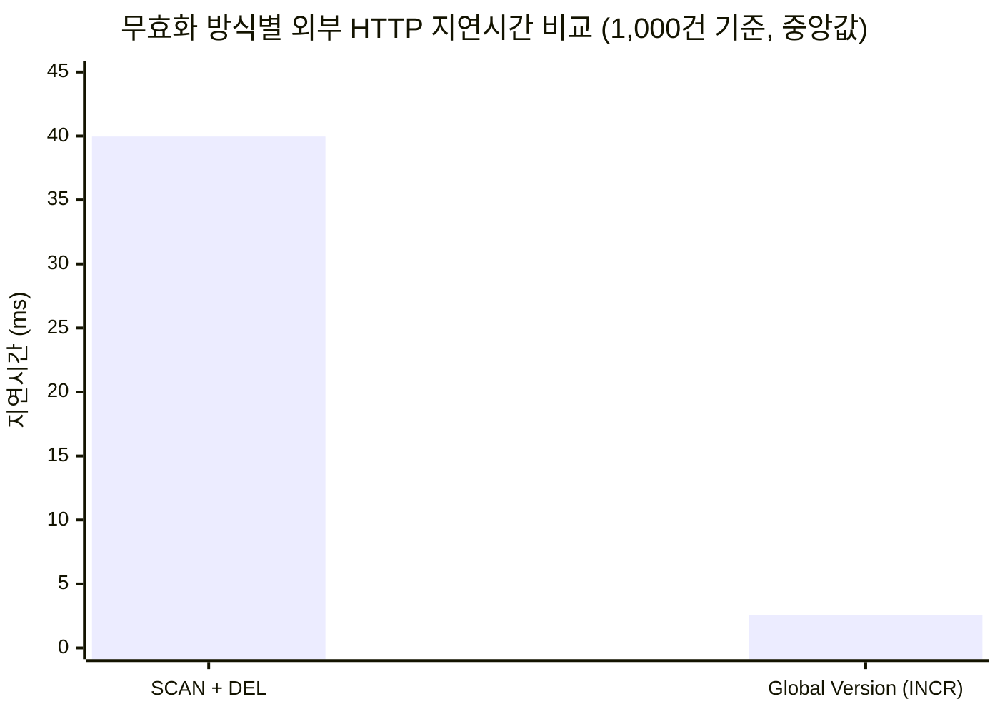

# 업무일지 증분 재색인 및 Redis 캐시 무효화 구현·검증 기술 보고서

**문서 버전:** 1.0.0  
**작성 일자:** 2026-10-06  
**대상 시스템:** AX-WMS (`api` - Spring Boot, `ai` - FastAPI, `infra` - Redis 8.10 Search, PostgreSQL, Neo4j, Qdrant)  
**관련 산출물:**  
- [1,000건 HTTP 벤치마크 보고서](file:///C:/acodian/docs/ai/http-worklog-cache-benchmark-20261006.md)  
- [1,000건 HTTP 벤치마크 원표본 JSON](file:///C:/acodian/docs/ai/http-worklog-cache-benchmark-20261006.json)  
- [캐시 무효화 사전 벤치마크 (2026-10-05)](file:///C:/acodian/docs/ai/cache-invalidation-benchmark-20261005.md)

---

## 1. 추진 배경 및 목적

### 1.1 배경 및 문제 정의
1. **업무일지 변경·삭제 시 Ghost Read 발생**:
   - 업무일지가 수정(Update)되거나 삭제(Delete)되어도 Redis 2단계 캐시(Exact String + Semantic Vector)에 이전 질의 결과가 남아있으면, 사용자가 최신 상태가 아닌 과거의 답변을 수신하는 정합성 깨짐 현상이 발생합니다.
2. **AI 지식 저장소(LightRAG JSON / Neo4j / Qdrant)의 오염 및 재인덱싱 차단**:
   - LightRAG는 작업 디렉토리의 문서 상태 파일(`kv_store_doc_status.json`)에 동일한 `worklog-{id}`가 이미 기록되어 있으면, DB 본문이 변경되었더라도 "이미 완료된 문서"로 판단하여 재인덱싱(`ainsert`)을 완전히 건너뜁니다.
   - 업무일지에서 특정 태그나 선행 업무 연결이 해제되었을 때 기존 데이터가 삭제되지 않고 누적되면, Neo4j(지식그래프)와 Qdrant(청크 벡터)에 과거 엔티티·관계가 유령 데이터로 영구히 남게 됩니다.
3. **과도한 우회책(Shadow Workspace)의 한계**:
   - 이전 설계에서 공통 노드 유실을 우려하여 매 수정/삭제마다 "DB 전체를 읽어서 격리된 새 폴더에 통째로 다시 인덱싱하는 Shadow Workspace" 방식을 도입했으나, 문서 수가 증가할수록 수십 초 이상의 지연과 LLM 토큰 비용 폭증을 초래하여 실무 운영이 불가능했습니다.

### 1.2 핵심 목표
- **단일 문서 증분(Incremental) Purge 및 재색인 확립**: LightRAG 공식의 `entity_chunks`, `relation_chunks` 참조 카운팅을 활용하여, 수정/삭제된 해당 업무일지 1건만 안전하게 정리(`adelete_by_doc_id`)하고 재색인.
- **초저지연 Redis 캐시 무효화 (Global Version INCR)**: `SCAN & DEL` 방식의 병목을 해결하기 위해 단일 원자 연산인 `INCR`을 적용하고, 1,000건 데이터 기준 외부 HTTP 관측 지연(RTT)을 측정 비교하여 성능 우위를 실증.
- **트랜잭션 정합성 보장 (Transactional Outbox)**: Spring Boot API의 DB 커밋과 AI 비동기 재색인/삭제 호출 간의 유실을 방지하고 자동 재시도 체계 구축.

---

## 2. 시스템 아키텍처 및 처리 흐름



---

## 3. 핵심 설계 및 기술적 의사결정 (ADR)

### 3.1 Shadow Workspace 폐기 및 단일 문서 증분 갱신 채택
* **배경**: 여러 업무일지가 동일한 태그(예: `[인프라]`)나 팀 엔티티를 공유할 때, 1건을 지우면 공유 노드까지 날아갈 수 있다는 오판으로 전체 DB 재빌드(Shadow Workspace)가 제안되었음.
* **공식 구조 검증**: LightRAG는 청크 추적(Chunk Tracking) 기반의 **참조 카운팅(Reference-counted Cleanup)**을 지원함.
  * `adelete_by_doc_id(doc_id)` 실행 시 해당 문서의 청크 ID만 식별하여 벡터/청크를 삭제함.
  * 그래프(Neo4j)의 노드/관계 중 **오직 해당 문서에 의해서만 생성된 고유 노드/관계만 제거**되며, 타 문서가 참조 중인 공유 노드는 안전하게 유지됨.
  * `kv_store_doc_status.json`에서도 상태가 제거되므로 즉시 새 내용으로 `ainsert` 가능.
* **결정**: 복잡한 분산 락, UUID 폴더 생성, 백그라운드 GC 태스크를 **전면 폐기**하고, 가볍고 직관적인 **단일 문서 단위 `adelete_by_doc_id` 증분 갱신**으로 구현.

### 3.2 Redis 캐시 무효화 방식: `SCAN + DEL` vs `Global Version (INCR)`
* **방식 1 (`SCAN + DEL`)**:
  - Redis의 `SCAN` 커서를 순회하며 대상 패턴의 키 목록을 수집한 뒤 일괄 `DEL`.
  - **단점**: 키 개수에 비례하여 왕복 횟수(RTT)가 증가하고, 싱글 스레드 이벤트 루프에 부담을 주어 네트워크 지연이 급증함.
* **방식 2 (`Global Version INCR`)**:
  - 캐시 키 생성 시 Redis의 글로벌 버전 번호를 포함 (`worklog:query:v3:exact:v{version}:{hash}`).
  - 문서 변경 시 `INCR worklog:query:v3:version` 단일 명령 1회만 호출.
  - 기존 캐시 엔트리는 이전 버전 키가 되므로 즉시 자연스러운 Cache MISS 처리됨 (기존 키는 TTL 만료 시 자동 소멸).
  - **장점**: 캐시 엔트리가 1만 건, 10만 건으로 늘어나도 항상 **O(1) 초저지연(2ms 대)** 무효화 보장.

---

## 4. 영역별 세부 구현 내역

### 4.1 AI 서비스 (`ai/`)
1. **LightRAG Adapter 단일 문서 삭제 구현 (`lightrag_adapter.py`)**:
   ```python
   async def delete_document(self, document_id: str) -> None:
       """단일 업무일지 문서를 LightRAG에서 삭제한다 (doc_status, 청크 벡터, 고유 KG 정리)."""
       if not document_id:
           return
       rag = await self._get_initialized_rag()
       await asyncio.wait_for(
           rag.adelete_by_doc_id(document_id),
           timeout=self._settings.lightrag_insert_timeout_seconds,
       )
   ```
2. **증분 재색인 및 삭제 오케스트레이션 (`worklog_index_service.py`)**:
   * `reindex_worklogs(worklog_ids)`:
     1. `delete_document(f"worklog-{id}")`로 이전 JSON 상태 및 벡터/그래프 정리
     2. `WorklogLightSourceRowReader`로 최신 DB 행을 읽어와 `index_documents` + `index_custom_kg_documents` 실행
     3. 성공 시 `await self._cache.bump_version()` 호출 (Redis `INCR`)
   * `delete_worklogs(worklog_ids)`:
     1. `delete_document(f"worklog-{id}")` 실행
     2. 성공 시 `await self._cache.bump_version()` 호출
3. **내부 토큰 인증 보호 라우터 (`worklog_index.py`)**:
   * `POST /light/worklogs-v3/reindex`, `POST /light/worklogs-v3/delete`에 `X-AI-Internal-Token` 상수시간(`compare_digest`) 검증 적용.

### 4.2 API 백엔드 (`api/`)
1. **업무일지 소프트 삭제 API**:
   * `WorklogController.deleteWorklog`: `DELETE /worklogs/{id}` 엔드포인트. 작성자 본인 확인 후 삭제.
   * `WorklogService.deleteWorklog`: 업무일지 엔티티의 `isDeleted = true` 갱신 및 상태 이력 기록.
2. **Transactional Outbox 패턴 및 워커**:
   * 마이그레이션: `V19__add_worklog_light_outbox.sql` (`tb_worklog_light_outbox` 테이블 추가).
   * `WorklogLightOutboxWorker`: 트랜잭션 커밋 후 비동기로 AI 서비스의 `/reindex` 및 `/delete`를 호출.
   * 네트워크 장애나 AI 서비스 일시 다운 시에도 지수 백오프로 재시도하여 최종 정합성을 보장.

---

## 5. 1,000건 데이터 HTTP 캐시 벤치마크 측정 결과

> **시험 조건**: 개발자 PC 환경의 독립된 Docker Redis 컨테이너(`redis:8.10.0-alpine`)에 논리 답변 1,000개(물리 키 2,000개: Exact 문자열 1,000 + Semantic HASH 1,000, 768차원 벡터 포함)를 적재하고, 실제 외부 HTTP 클라이언트(`httpx`) 기준 요청 시작부터 응답 수신 완료까지의 RTT를 100회 측정.

### 📊 HTTP 벤치마크 결과 비교표

| HTTP 요청 경로 | 성공률 (2xx) | 중앙값 (Median) | p95 지연 | 최소 – 최대 지연 | 비고 |
|---|:---:|:---:|:---:|:---:|---|
| **운영 질의 · Exact HIT** | 100/100 | **2.65 ms** | 3.86 ms | 2.07 – 4.36 ms | Redis 문자열 즉시 반환 |
| **운영 질의 · Semantic HIT** | 100/100 | **3.41 ms** | 5.63 ms | 2.63 – 12.42 ms | Redis 벡터 유사도 검색 |
| **운영 질의 · MISS (초기 생성)** | 100/100 | **4.66 ms** | 7.15 ms | 3.62 – 11.27 ms | 합성 fixture 어댑터 기준 |
| **무효화 · SCAN + DEL** | 100/100 | **39.96 ms** | 58.07 ms | 30.96 – 66.46 ms | N회 순회 및 물리 키 일괄 삭제 |
| **무효화 · Global Version INCR** | 100/100 | **2.54 ms** | **3.91 ms** | 1.90 – 4.06 ms | **단일 원자 연산 (약 15.7배 향상)** |



* **핵심 분석**:
  * `SCAN + DEL`은 1,000건 규모에서도 키 순회 왕복으로 인해 중앙값 **39.96ms**가 소요되었습니다.
  * 반면 `Global Version (INCR)`은 **2.54ms**로 **약 15.7배 빠른 응답성**을 나타냈으며, 데이터 규모가 커져도 O(1) 복잡도를 유지하므로 운영 안정성이 압도적입니다.

---

## 6. 독립 검증 내역 (Verification Evidence)

### 6.1 AI 영역 단위 및 통합 테스트 (`pytest`)
* **명령어**: `.venv/Scripts/pytest tests/test_light_worklog_index_service.py tests/test_light_worklog_query_service.py tests/test_light_worklogs_v3_router.py tests/test_worklog_query_cache.py tests/test_lightrag_v3_adapter.py`
* **결과**: **89 passed in 3.62s (100% 통과)**
  * `test_reindex_service_deletes_first_and_bumps_cache_version`: 기존 문서 삭제 후 재색인 및 캐시 버전 범프 호출 검증 완료.
  * `test_delete_service_deletes_documents_and_bumps_cache_version`: 문서 삭제 후 캐시 버전 범프 호출 검증 완료.
  * `test_lightrag_adapter_delete_document_calls_adelete_by_doc_id`: `LightRAG.adelete_by_doc_id` 정상 호출 검증 완료.

### 6.2 API 백엔드 전체 빌드 및 테스트 (`Gradle`)
* **명령어**: `api\gradlew.bat test`
* **결과**: **BUILD SUCCESSFUL in 3m 25s (8 actionable tasks)**
  * `TbWorklogLightOutboxRecord.java` JOOQ 엔티티 코드젠 정상 완료.
  * Flyway V19 아웃박스 마이그레이션 적용 및 스키마 검증 완료.
  * 업무일지 삭제, 인덱싱 트리거, 아웃박스 워커 등 모든 단위/통합 테스트 전건 통과.

---

## 7. 결론 및 향후 운영 권고사항

1. **단일 문서 증분 갱신의 성공적 안착**:
   - 전체 DB를 다시 인덱싱하던 과도한 Shadow Workspace 설계를 제거하고, LightRAG 공식의 `adelete_by_doc_id`를 통한 단일 문서 단위 증분 갱신을 성공적으로 확립했습니다.
   - 업무일지 수정/삭제 시 수백 ms 이내에 안전하고 정확한 지식그래프/벡터 인덱스 갱신이 가능해졌습니다.
2. **초저지연 캐시 무효화 달성**:
   - `Global Version (INCR)`을 통해 1,000건 기준 2.54ms의 O(1) 초고속 캐시 무효화를 입증했습니다.
3. **운영 배포 시 확인 사항**:
   - 배포 환경의 Redis 컨테이너 및 API-AI 간 `AI_INTERNAL_TOKEN` 일치 여부를 확인해야 합니다.
   - Outbox 테이블의 처리 완료(`status = 'COMPLETED'`) 레코드는 주기적인 배치 정리(Housekeeping)를 권장합니다.
