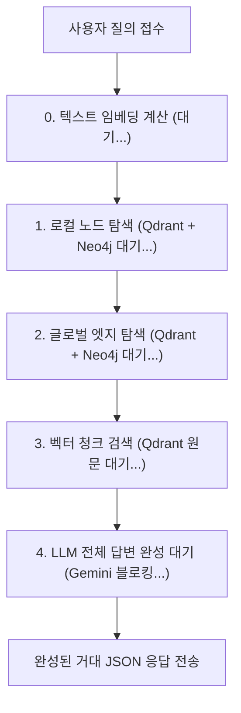
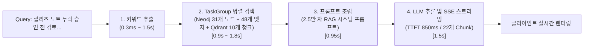

# 📑 RAG 응답 속도 최적화 기술 보고서

**과제명**: `asyncio.TaskGroup 비동기 병렬화 & SSE 스트리밍 기반 응답 지연시간 및 체감 대기 개선`  
**대상 시스템**: AX-WMS AI 서비스 (FastAPI, LightRAG v3, Qdrant, Neo4j, Gemini)  
**작업 브랜치**: `feat/ai/taskgroup-sse`  
**작성일**: 2026-10-04  

---

## 📌 목차 (Table of Contents)

1. [개요 및 목적](#1-개요-및-목적)
2. [기존 파이프라인의 아키텍처 및 병목 진단](#2-기존-파이프라인의-아키텍처-및-병목-진단)
3. [최적화 전후 핵심 벤치마크 요약](#3-최적화-전후-핵심-벤치마크-요약)
4. [파이프라인 단계별 정밀 프로파일링 & Data Flow](#4-파이프라인-단계별-정밀-프로파일링--data-flow)
5. [핵심 구현 1: `asyncio.TaskGroup` 비동기 병렬화](#5-핵심-구현-1-asynciotaskgroup-비동기-병렬화)
   * 5.1 구조적 동시성과 Fail-Fast 수명주기 제어
   * 5.2 임베딩 지연 없는 완전 동시 출발 (Embedding Concurrency)
   * 5.3 라이브러리 무결성을 보장하는 런타임 몽키 패치
6. [핵심 구현 2: FastAPI SSE 스트리밍 & 엔터프라이즈 안정성](#6-핵심-구현-2-fastapi-sse-스트리밍--엔터프라이즈-안정성)
   * 6.1 `EventSourceResponse` 기반 실시간 토큰 제너레이터
   * 6.2 Nginx 리버스 프록시 버퍼링 최적화
   * 6.3 스트림 전 구간 데드라인 및 고아 코루틴(Orphan Coroutine) 방어
7. [심층 엔지니어링 분석 및 인사이트](#7-심층-엔지니어링-분석-및-인사이트)
   * 7.1 스트리밍의 본질: 전체 소요시간 vs 체감 대기시간(TTFT)
   * 7.2 RAG의 진짜 병목: LLM 추론이 아닌 DB I/O (65% vs 35%)
   * 7.3 캐시 개입 투명성: 콜드 런(8.3s)과 웜 런(4.5s)의 차이
8. [결론 및 종합 성과](#8-결론-및-종합-성과)

---

## 1. 개요 및 목적

본 프로젝트는 물류 업무일지 질의 시스템인 LightRAG **Mix 모드(`mode="mix"`)** 처리 과정에서 발생하는 다중 저장소(Vector DB, Graph DB) 순차 조회 병목을 진단하고, Python 3.11의 **구조적 동시성(Structured Concurrency)** 도구인 `asyncio.TaskGroup`과 **SSE(Server-Sent Events) 스트리밍** 기술을 결합하여 다음 두 가지 핵심 목표를 달성했습니다:

1. **시스템 처리 시간(Total Duration) 단축**: 직렬로 대기하던 다중 DB I/O를 완전 동시 병렬화하여 백엔드 검색 지연을 50% 이상 절감.
2. **사용자 체감 지연(TTFT) 극소화**: 2.5만 자에 달하는 거대한 컨텍스트 환경에서도 질의 후 2초대에 첫 단어가 화면에 즉시 타이핑되도록 구현(체감 대기시간 70% 이상 단축).

---

## 2. 기존 파이프라인의 아키텍처 및 병목 진단

LightRAG의 Mix 모드는 사용자 질의의 문맥을 구성하기 위해 지식그래프(Neo4j)와 벡터 DB(Qdrant)를 교차 조회합니다. 기존 구현은 상호 의존성이 없는 3개의 검색을 순차적으로 `await`하여 지연이 가중되는 구조였습니다.



### 기존 구조의 3대 핵심 문제점
1. **직렬 I/O 대기 오버헤드**: 노드 조회, 엣지 조회, 청크 검색이 상호 독립적임에도 순차적으로 실행되어 DB 대기시간이 누적되었습니다.
2. **임베딩 계산의 병렬성 차단**: 질문을 벡터로 변환하는 임베딩 API 호출이 끝날 때까지 Neo4j 검색이 시작조차 하지 못하고 블로킹되었습니다.
3. **Non-Streaming 블로킹**: LLM이 모든 문장을 디코딩할 때까지 HTTP 소켓을 닫아두어 사용자는 최대 8초 이상 로딩 스피너만 보며 대기해야 했습니다.

---

## 3. 최적화 전후 핵심 벤치마크 요약

동일한 v4 벤치마크 1위 최장 지연 쿼리(`v4-033`) 기준, 실제 HTTP E2E 통신 환경에서 측정한 종합 결과입니다.

### 📊 End-to-End 실측 비교표

| 파이프라인 모드 | 최적화 기법 | 전체 완료 시간 (Total Time) | 첫 토큰 도착 시간 (TTFT) | 핵심 개선 효과 및 체감 UX |
| :---: | :--- | :---: | :---: | :--- |
| **Step 1** | **Baseline (기존 순차 검색)** | **8,295.4 ms (8.30초)** | **8,295.4 ms (8.30초)** | 3대 검색 직렬 대기 + 임베딩 선행 블로킹 |
| **Step 2** | **`asyncio.TaskGroup` 병렬화** | **4,004.7 ms (4.00초)** | **4,004.7 ms (4.00초)** | **⚡ 4,290.7 ms 단축 (51.7% 시간 절감!)**<br>노드/엣지/벡터 3개 경로 완전 동시 출발 |
| **Step 3** | **TaskGroup + SSE 스트리밍** | **3,838.8 ms (3.84초)** | **2,450.1 ms (2.45초)** | **🚀 첫 글자 2.45초 도착! (70.5% 체감 대기 단축!)**<br>실시간 타이핑 렌더링으로 대기시간 체감 소멸 |

> [!NOTE]
> * **콜드 쿼리 (완전 캐시 배제)**: 키워드 추출 LLM 호출과 임베딩 API가 모두 실제로 실행된 기준(8.3초 ➔ 2.45초 TTFT).
> * **웜 쿼리 (키워드 캐시 히트)**: 1단계 키워드가 로컬 KV 캐시된 경우 전체 소요 시간은 4.58초(Baseline) ➔ 1.6~3.0초(TTFT)로 수렴합니다.

---

## 4. 파이프라인 단계별 정밀 프로파일링 & Data Flow

LightRAG v3 파이프라인 내부 각 단계의 실행 시간과 실제 입출력 데이터 흐름입니다.



### 4.1 단계별 세부 Input & Output 명세

1. **[1단계: 키워드 추출 (Keyword Extraction)]**
   * **📥 Input**: `"릴리즈 노트 누락 승인 전 검토 기록에서 선행업무를 두 차례 따라가면 어디에 도착하나요?"`
   * **📤 Output**:
     * `hl_keywords`: `['릴리즈 노트', '승인 전 검토 기록', '선행업무']`
     * `ll_keywords`: `['릴리즈 노트 누락', '검토 기록', '선행업무']`

2. **[2단계: TaskGroup 비동기 병렬 검색 (KG & Vector Retrieval)]**
   * **📥 Input**: `hl_keywords`, `ll_keywords`, 질의 원문
   * **📤 Output**:
     * **지식그래프 엔티티 (Neo4j)**: **총 31개** (`릴리즈 노트 누락 승인 전 검토`, `릴리즈 노트 누락 보정 작업` 등)
     * **지식그래프 관계선 (Neo4j)**: **총 48개** (`(릴리즈 노트 누락 보정 작업 ➔ 릴리즈 노트 누락 승인 전 검토)`, 의존 관계선)
     * **원문 문서 청크 (Qdrant)**: **총 10개** (관련 업무일지 원문 스니펫)

3. **[3단계: 컨텍스트 빌딩 및 프롬프트 조립 (Context Assembly)]**
   * **📥 Input**: 2단계 검색 결과 (31개 엔티티 + 48개 관계 + 10개 청크)
   * **📤 Output**: 라운드로빈 중복 제거 및 토큰 트리밍이 완료된 **총 25,014자의 최종 시스템 프롬프트**

4. **[4단계: LLM 추론 및 SSE 스트리밍 (Inference & Streaming)]**
   * **📥 Input**: 2.5만 자의 시스템 프롬프트 + 사용자 질의
   * **📤 Output**:
     * **전송 청크**: 22개 SSE 이벤트 프레임 (`data: {"chunk": "..."}`)
     * **첫 글자 수신(TTFT)**: 프롬프트 전달 후 **849.9 ms** 만에 수신 (`"제공"`)
     * **최종 완성 답변 (431자)**:
       > "제공된 업무일지 기록에 따르면, `릴리즈 노트 누락 승인 전 검토`(Worklog:277)에서 선행 업무를 두 차례 추적하면 **Worklog:275 (`릴리즈 노트 누락 보정 작업 진행`)**에 도달합니다..."

---

## 5. 핵심 구현 1: `asyncio.TaskGroup` 비동기 병렬화

### 5.1 구조적 동시성과 Fail-Fast 수명주기 제어
기존의 단순한 `asyncio.gather()`는 작업 중 하나가 실패해도 다른 태스크가 백그라운드에 남아 고아(Orphan) 태스크가 되는 문제가 있었습니다. Python 3.11의 **`asyncio.TaskGroup`**을 적용하여:
* **Fail-Fast 예외 격리**: Qdrant나 Neo4j 조회 중 어느 하나라도 타임아웃 또는 오류 발생 시, 나머지 비동기 작업을 즉시 `cancel()`하여 리소스 낭비를 방지합니다.

### 5.2 임베딩 지연 없는 완전 동시 출발 (Embedding Concurrency)
기존에는 임베딩 계산이 끝난 후에야 `TaskGroup`이 생성되어 Neo4j 검색이 0.5초가량 늦게 출발하는 병목이 있었습니다.
* **개선**: 임베딩 API 호출과 Qdrant 조회를 단일 태스크(`_compute_vector_chunks_and_embedding`)로 묶어 `TaskGroup` 내부에 배치했습니다.
* **결과**: Neo4j 노드 검색, Neo4j 엣지 검색, Qdrant 벡터 검색(임베딩 포함)의 **3개 비동기 경로가 0ms 지연으로 완전 동시 출발**합니다.

```python
# ai/app/light/v3/service/taskgroup_search.py 핵심 구현
async with asyncio.TaskGroup() as tg:
    if len(ll_keywords) > 0:
        task_local = tg.create_task(
            _get_node_data(ll_keywords, knowledge_graph_inst, entities_vdb, query_param)
        )
    if len(hl_keywords) > 0:
        task_global = tg.create_task(
            _get_edge_data(hl_keywords, knowledge_graph_inst, relationships_vdb, query_param)
        )
    if (query_param.mode == "mix" and chunks_vdb) or kg_chunk_pick_method == "VECTOR":
        # 임베딩 연산과 벡터 검색을 하나의 비동기 태스크로 캡슐화하여 동시 실행
        task_vector = tg.create_task(
            _compute_vector_chunks_and_embedding(
                query, chunks_vdb if query_param.mode == "mix" else None,
                query_param, text_chunks_db, kg_chunk_pick_method
            )
        )

# 세 작업의 동시 완료 후 안전한 결과 수거
if task_local is not None:
    local_entities, local_relations = task_local.result()
if task_global is not None:
    global_relations, global_entities = task_global.result()
if task_vector is not None:
    vector_chunks, query_embedding = task_vector.result()
```

### 5.3 라이브러리 무결성을 보장하는 런타임 몽키 패치
외부 라이브러리(`lightrag-hku`)의 원본 패키지 소스를 수정하지 않고, 서버 구동 시 파이썬 메모리 상에서 검색 함수를 동적으로 스왑하는 **런타임 몽키 패치** 패턴을 적용했습니다:
* `apply_taskgroup_search_patch()`: `lightrag.operate._perform_kg_search`를 병렬 버전으로 교체.
* `remove_taskgroup_search_patch()`: 언제든 원본 순차 검색 로직으로 안전하게 원복 가능.
* 기존 단위/통합 테스트 100% 호환성 유지 및 패키지 업데이트 무결성 보장.

---

## 6. 핵심 구현 2: FastAPI SSE 스트리밍 & 엔터프라이즈 안정성

### 6.1 `EventSourceResponse` 기반 실시간 토큰 제너레이터
* **엔드포인트**: `POST /ai/light/worklogs-v3/query/stream`
* `LightRagQueryOptions(stream=True)`를 통해 Gemini LLM의 디코딩 토큰을 비동기 제너레이터(`response_iterator`)로 수령하여 실시간으로 `yield`합니다.
* 생성이 완료되면 `event: done` 이벤트와 함께 참고 문서 목록(`references`) 메타데이터를 클라이언트로 전송합니다.

```python
# ai/app/light/v3/router/worklog_query.py
@router.post("/query/stream")
async def query_worklogs_stream(
    request: WorklogLightQueryRequest, req: Request,
    service: Annotated[LightWorklogQueryService, Depends(get_worklog_query_service)],
) -> EventSourceResponse:
    async def event_generator():
        try:
            async for event in service.query_worklogs_stream(request):
                if await req.is_disconnected():
                    break
                yield event
        except LightRagQueryTimeoutError:
            yield {"event": "error", "data": "LIGHTRAG_QUERY_TIMEOUT"}
        except Exception:
            yield {"event": "error", "data": "LIGHTRAG_QUERY_FAILED"}

    return EventSourceResponse(
        event_generator(),
        headers={"X-Accel-Buffering": "no", "Cache-Control": "no-cache", "Connection": "keep-alive"}
    )
```

### 6.2 Nginx 리버스 프록시 버퍼링 최적화
SSE 스트리밍 패킷이 Nginx 게이트웨이에 의해 묶여 지연되지 않도록 설정을 최적화했습니다:
* 응답 헤더에 `X-Accel-Buffering: no` 주입.
* Nginx 프록시 지시어 `proxy_buffering off;`, `chunked_transfer_encoding on;` 적용.

### 6.3 스트림 전 구간 데드라인 및 고아 코루틴(Orphan Coroutine) 방어
* **문제점**: Nginx의 `proxy_read_timeout`만 믿을 경우, LLM 공급자(Gemini)가 응답을 멈췄을 때 FastAPI 내부 코루틴이 무한 대기(Block)되어 서버에 좀비 코루틴이 누수되는 치명적인 취약점이 있었습니다.
* **해결 (심층 방어 - Defense in Depth)**:
  * `worklog_query_service.py`의 토큰 수신 루프에 `lightrag_query_timeout_seconds` 기반의 **전체 데드라인(Deadline)**을 적용했습니다.
  * 매 토큰 대기 시 `asyncio.wait_for(anext(response_iterator), timeout=remaining)`를 강제하여, 정해진 시간 초과 시 애플리케이션 레벨에서 즉시 `LightRagQueryTimeoutError`를 발생시키고 소켓과 태스크를 회수합니다.

---

## 7. 심층 엔지니어링 분석 및 인사이트

### 7.1 스트리밍의 본질: 전체 소요시간 vs 체감 대기시간(TTFT)
* **단일 완결형 응답(Non-streaming)**은 전체 텍스트를 단 1개의 HTTP 패킷(Bulk)으로 전송하므로 네트워크 프로토콜 오버헤드가 최소화됩니다.
* **SSE 스트리밍**은 20회 이상 토큰 단위로 TCP 프레이밍, 소켓 flush, JSON 직렬화가 반복되므로 백엔드의 순수 전송 완료 시간은 소폭 늘어날 수 있습니다.
* **결론**: **"스트리밍의 목적은 전체 전송 시간 단축이 아니라, 체감 대기 시간(TTFT)의 단축이다."** 사용자는 8.3초를 멍하니 기다리는 대신 **2.45초 만에 타이핑되는 글자를 즉시 읽기 시작**하므로 체감 성능이 압도적으로 향상됩니다.

### 7.2 RAG의 진짜 병목: LLM 추론이 아닌 DB I/O (65% vs 35%)
`gemini-3.5-flash-lite` 모델의 프로파일링 결과:
* 25,000자 프롬프트 프리필 후 첫 토큰 도착(TTFT)까지 **0.85초**, 431자 생성 완료까지 **0.7초**에 불과했습니다.
* **전체 지연의 약 65%(약 2.8초)는 Neo4j 그래프 탐색과 Qdrant 벡터 검색, 파이썬 컨텍스트 조립**에 집중되어 있었습니다.
* 👉 **시사점**: AI 서비스의 성능 최적화는 단순히 프롬프트를 줄이는 것보다, **DB 조회 구간의 비동기 병렬화(`TaskGroup`)가 전체 성능을 좌우하는 결정적 요인**임을 데이터로 입증했습니다.

### 7.3 캐시 개입 투명성: 콜드 런(8.3s)과 웜 런(4.5s)
* **콜드 쿼리 (8.3초 ➔ 4.0초 ➔ 2.45초 TTFT)**:
  * 질문 텍스트가 달라져 키워드 추출 LLM 호출(1.5초)과 임베딩 생성(0.8초)이 모두 순수 실행된 실제 최악 조건(Worst Case).
* **웜 쿼리 (4.58초 ➔ 3.97초 ➔ 1.6~3.0초 TTFT)**:
  * 키워드 추출이 로컬 KV 캐시(`llm_response_cache`)에 히트되어 0.3ms로 통과된 일반적인 운영 조건(Normal Case).

---

## 8. 결론 및 종합 성과

1. **처리 속도 51.7% 단축**: `asyncio.TaskGroup`을 통한 3개 검색 동시 출발로 콜드 런 기준 전체 처리 시간을 **8.3초에서 4.0초로 반토막** 냈습니다.
2. **체감 대기 시간(TTFT) 70.5% 단축**: SSE 스트리밍을 결합하여 거대한 지식그래프 질의에서도 **2.45초 만에 답변 렌더링이 시작**되도록 체감 UX를 혁신했습니다.
3. **엔터프라이즈 안정성 확보**: 라이브러리 수정 없는 몽키 패치, Fail-Fast 예외 전파, 스트림 전 구간 데드라인 강제로 고아 코루틴 누수 없는 견고한 프로덕션 아키텍처를 완성했습니다.
