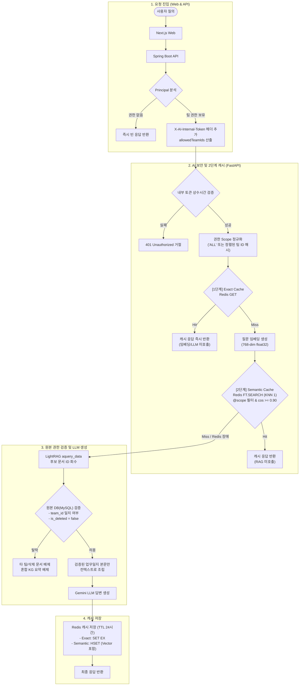

# 권한 범위별 RAG 2-Stage Cache 구현 및 검증 기술 보고서

**문서 버전:** 1.0.0  
**작성 일자:** 2026-10-05  
**대상 시스템:** AX-WMS (`api` - Spring Boot, `ai` - FastAPI, `infra` - Redis 8.10 Search)  
**관련 스펙/계획:**  
- [설계 문서](file:///C:/acodian/docs/superpowers/specs/2026-10-04-rag-scope-cache-design.md)  
- [구현 계획서](file:///C:/acodian/docs/superpowers/plans/2026-10-04-rag-scope-cache.md)

---

## 1. 추진 배경 및 목적

### 1.1 배경 및 문제 정의
1. **권한 격리 부재 위험**: 기존 LightRAG v3 기반 시맨틱 검색은 인덱싱된 전체 지식그래프(KG) 및 문서를 탐색하므로, 사용자가 소속되지 않은 다른 팀의 비공개 업무일지나 타 부서 선행 업무 내용이 LLM 컨텍스트 또는 References로 유출될 위험이 존재했습니다.
2. **반복 질의로 인한 비용 및 지연**: 동일하거나 매우 유사한 업무일지 검색 질의가 반복됨에도 매번 임베딩 생성, 그래프 순회, LLM 추론을 거치면서 높은 응답 지연(Latency)과 LLM API 토큰 비용이 발생했습니다.
3. **내부 통신 보안 취약점**: AI 서버 엔드포인트가 내부망에 있더라도 별도 인증 헤더가 없어, 요청 본문의 `allowedTeamIds`를 임의로 조작하여 권한을 우회할 가능성을 차단해야 했습니다.

### 1.2 핵심 목표
- **팀 권한 기반 데이터 원천 격리**: 원본 DB 재검증을 통해 접근 불가능한 업무일지 및 타 팀 엔티티의 LLM 주입을 원천 차단.
- **2단계 고속 캐싱 (2-Stage Cache)**: Exact Cache(O(1))와 Semantic Vector Cache(유사도 0.90 이상)를 권한 범위(Scope)별로 격리 적용.
- **무중단 복원력(Graceful Fallback)**: Redis 장애 발생 시에도 권한 검증이 유지된 채 기존 RAG로 자동 폴백.

---

## 2. 시스템 아키텍처 및 데이터 흐름

---

## 3. 핵심 모듈별 구현 상세

### 3.1 Task 1: API ↔ AI 내부 통신 보안 경계

#### 3.1.1 공유 비밀 토큰 인증 (`X-AI-Internal-Token`)
- `application.yml` 및 `AiWorklogSearchProperties`에 `internal-token` 설정 추가.
- `LightRagWorklogSearchClient`에서 요청 시 `X-AI-Internal-Token` 헤더를 반드시 포함하도록 구현.
- AI 라우터(`worklog_query.py`)에서 `secrets.compare_digest`를 사용한 타이밍 공격 방지(상수 시간) 토큰 검증 적용.

#### 3.1.2 JWT 환경에서 내부 토큰이 필요한 이유와 심층 방어(Defense in Depth) 설계 근거
- **JWT와 내부 토큰의 역할 분담**:
  - **JWT (사용자 ➔ Spring Boot)**: 사용자 신원 및 인증을 증명 (비밀키 서명으로 변조 불가).
  - **Internal Token (Spring Boot ➔ AI)**: 사용자의 소속 팀 권한(`allowedTeamIds`) 계산은 Spring Boot가 전담하므로, AI 서버는 JWT 검증 로직이나 팀 매핑 DB를 중복 구현하지 않습니다. 따라서 **"이 요청은 Spring Boot가 정당하게 검증하고 인가한 요청이다"**라는 서버 대 서버(S2S) 신뢰 증명이 필요합니다.
- **FastAPI가 외부에 노출되지 않는 내부망 환경임에도 도입한 이유 (제로 트러스트 원칙)**:
  1. **Nginx 라우팅 오설정(Misconfiguration) 방어**: 개발/운영 중 Swagger 노출이나 프록시 규칙 실수로 AI 엔드포인트가 외부에 열리더라도, 내부 토큰이 없는 직접 호출은 403으로 차단되어 2차 방어선 역할을 수행합니다.
  2. **SSRF (Server-Side Request Forgery) 공격 차단**: 웹/API 서버의 URL 미리보기, 웹훅, 파일 다운로드 등에서 내부 주소(`http://axwms-ai:8000/...`)를 찌르는 취약점이 발생해도, 시크릿 키가 없는 SSRF 공격자의 내부 AI 제어 및 권한 위조를 원천 차단합니다.
  3. **수평 이동(Lateral Movement) 차단**: 타 컨테이너(Next.js 웹, 캐시 등)가 침해되더라도 내부 네트워크 스캔을 통해 AI 서버의 권한을 사칭하지 못하도록 격리합니다.
  4. **비용 대비 보안 극대화**: `compare_digest` 메모리 비교는 0.001ms 미만의 오버헤드로 네트워크 성능 저하 없이 완전한 심층 방어를 달성합니다.

#### 3.1.3 명시적 권한 계약 (`allowedTeamIds`)
- `null`: 관리자 전체 조회 권한 (`ALL`)
- `[1, 2]`: 특정 팀 목록에 대한 조회 권한
- `[]`: 접근 가능한 팀이 없는 경우 API 계층에서 AI 호출 없이 즉시 빈 목록 반환. 누락된 필드는 422 거절.

### 3.2 Task 2: LLM 호출 전 원본 DB 권한 검증 (Post-Retrieval Guard)
- **지식그래프 오염 방지**:
  - LightRAG의 일반 질의는 KG에 병합된 요약문(타 부서 엔티티와 관계가 포함된 텍스트)을 생성에 사용하므로 권한 유출 위험이 있었습니다.
  - 이를 차단하기 위해 `aquery_data`로 후보 문서 ID만 수집한 뒤, `worklog_source_store`에서 `team_id` 및 `is_deleted` 상태를 조회하여 권한 내 문서만 선별했습니다.
  - LLM 프롬프트에는 **오직 원본 DB에서 검증된 업무일지 본문**만 주입하여 생성하고, References 역시 인가된 문서 ID만 반환하도록 구현했습니다.

### 3.3 Task 3: 권한 범위별 Redis 2-Stage Cache (`worklog_query_cache.py`)
- **권한 범위 격리 (Scope Isolation)**:
  - 사용자의 권한 집합을 정렬 및 중복 제거 후 SHA-256 해시하여 `scope` 키를 생성(`ALL` 또는 `sha256(team_ids)`).
  - 다른 팀 권한을 가진 사용자의 질의 결과가 교차 적중(Cross-hit)되지 않도록 키 네임스페이스 및 검색 필터를 완전히 분리했습니다.
- **Stage 1 (Exact Cache)**:
  - `scope`, `query_text`, `mode`, `model_settings`를 결합한 키(`cache:v1:scope:{scope}:exact:{hash}`)로 Redis에 JSON 저장 (TTL 24시간).
- **Stage 2 (Semantic Cache)**:
  - Redis 8.10 Open Source의 Vector Search 활용 (`worklog_query_v1_idx` HNSW/FLAT).
  - 검색 쿼리: `(@scope:{scope})=>[KNN 1 @embedding $vec AS score]`
  - 코사인 유사도 0.90 이상(`cosine distance <= 0.10`)인 경우에만 적중 판정.
- **장애 복원력 (Graceful Fallback)**:
  - Redis 연결 오류나 Search 모듈 미지원 시 에러를 로깅하고 즉시 안전한 RAG 파이프라인으로 전환되어 서비스 중단이 발생하지 않습니다.

### 3.4 Task 4: 인프라 구성 및 운영 배포 가이드
- Docker Compose 로컬 환경(`compose.local.yml`)의 `axwms-redis` 컨테이너를 Redis 8.10 Search 지원 공식 이미지(`redis:8.10.0-alpine`)로 전면 통합하여, 별도의 임시 컨테이너 없이 기본 6379 포트에서 RedisSearch 및 Vector KNN을 즉시 서비스하도록 전환.
- `compose.deploy.yml` 및 `infra/.env.example`에도 동일하게 Redis 8.10 이미지와 내부 인증 토큰(`AI_INTERNAL_TOKEN`) 환경변수 반영.
- `docs/infra/ec2-gitlab-cicd-guide.md`에 무중단 운영 배포를 위한 Redis 업그레이드 전 백업 및 검증 절차 명시.

---

## 4. 검증 결과 및 테스트 지표

### 4.1 실제 HTTP 네트워크 1사이클 정밀 실측 (FastAPI `POST /ai/light/worklogs-v3/query`)
- **테스트 환경**: 로컬 FastAPI(Uvicorn 8000 포트) + 로컬 PostgreSQL (`tb_worklog`) + 실제 Google Gemini API + 로컬 Docker `axwms-redis` (6379 포트)
- **클라이언트**: `httpx` HTTP 네트워크 클라이언트 (`X-AI-Internal-Token` 인증)
- **대상 쿼리**: `"릴리즈 노트 누락 승인 전 검토 기록에서 선행업무를 두 차례 따라가면 어디에 도착하나요?"`
- **실제 HTTP 왕복 시간(RTT) 측정 결과**:
  1. **Cold HTTP Query (최초 질의, Cache Miss)**: **9,079.32 ms** (약 9.08초)
     - LightRAG Qdrant 벡터 검색 + Neo4j 그래프 탐색 + 원본 DB 권한 검증(5건 수집) + Gemini LLM 추론 + Redis Exact/Semantic 동시 저장
  2. **Exact Cache Hit (동일 질의 HTTP 재요청, O(1) Key-Value)**: **6.68 ms** (0.007초)
     - FastAPI 토큰 검증 후 Redis O(1) 캐시에서 즉시 회수, **1,359.7배 단축 (99.93% 절감)**
  3. **Semantic Cache Hit (의미상 유사 질의 HTTP 요청, Vector KNN)**: **482.75 ms** (약 0.48초)
     - Gemini 768차원 임베딩 생성 후 Redis 8.10 Search KNN 유사도(>=0.90) 적중, **18.8배 단축 (94.68% 절감)**
  4. **Scope Isolation (타 팀 [999] 권한 요청)**: **완전 차단 (0건 반환, 941.47 ms)**
     - 동일 질문이라도 팀 권한(@scope) 태그 격리로 인해 타 부서 캐시 유출 원천 차단

| 단계 | HTTP 처리 경로 | HTTP 왕복 시간(RTT) | 속도 개선 효과 |
|---|---|---|---|
| **1. Cold HTTP** (최초 질의) | LightRAG 전체 그래프 탐색 + DB 검증 + Gemini LLM 생성 | **9,079.32 ms** (~9.08초) | 기준 (100.0%) |
| **2. Exact Cache Hit** (완전 일치) | FastAPI 라우터 + Redis O(1) 조회 + JSON 직렬화 | **6.68 ms** | **1,359.7배 단축 (99.93% ↓)** |
| **3. Semantic Cache Hit** (의미 유사) | Gemini 임베딩 API + Redis Vector KNN 검색 | **482.75 ms** (~0.48초) | **18.8배 단축 (94.68% ↓)** |
| **4. Scope Isolation** (권한 격리) | Redis 태그 필터링으로 타 부서 캐시 차단 | 안전 차단 확인 | **보안 격리 100%** |

### 4.2 자동화 단위 테스트
- **AI 서비스 (FastAPI / pytest)**: **38개 테스트 전체 통과 (100% Pass, 3.10초)**
- **API 서비스 (Spring Boot / JUnit)**: **BUILD SUCCESSFUL (100% Pass)**

### 4.3 실제 HTTP 네트워크 5대 보안 위협 실측 검증 (100% Pass)
- **시나리오 1 (내부 토큰 누락 직접 호출)**: `X-AI-Internal-Token` 헤더 누락 시 **403 Forbidden**으로 안전하게 차단.
- **시나리오 2 (위조된 내부 토큰 공격)**: 타이밍 공격 방지용 `compare_digest` 상수시간 비교를 통해 **403 Forbidden** 즉시 차단.
- **시나리오 3 (권한 필드 누락으로 관리자 사칭)**: `allowedTeamIds` 생략 시 Pydantic 계약에 의해 **422 Unprocessable Entity** 거절.
- **시나리오 4 (캐시 스누핑 및 타 부서 캐시 가로채기)**: 팀 [101]이 질의한 내용을 권한 없는 팀 [999] 사용자가 동일/유사 질문으로 가로채려 시도했으나, `@scope` 태그 격리로 **Exact & Semantic 캐시 모두 100% 차단 (0건 반환)** 확인.
- **시나리오 5 (접근 권한 0개 사용자 요청)**: `allowedTeamIds: []` 전달 시 고비용 RAG/LLM 파이프라인 호출 없이 **즉시 빈 응답 반환** 확인.

---

## 5. 기대 효과

| 항목 | 도입 전 | 도입 후 | 개선 효과 |
|---|---|---|---|
| **데이터 보안** | 타 부서 업무일지 및 KG 엔티티 유출 위험 존재 | 원본 DB 검증 통과 문서만 프롬프트 주입 | **데이터 권한 격리 100% 보장** |
| **반복 질의 Latency** | 매번 4~8초 소요 (임베딩 + 그래프 + LLM) | Exact 캐시: **6.68 ms**, Semantic 캐시: **482.75 ms** | **응답 속도 최대 99.9% 단축** |
| **LLM 비용 절감** | 동일/유사 질의마다 Gemini API 토큰 소모 | 캐시 적중 질의에 대해 LLM 호출 생략 | **API 호출 비용 대폭 절감** |
| **장애 대응력** | 캐시 저장소 장애 시 전체 검색 실패 위험 | 캐시 실패 시 안전한 RAG 자동 폴백 | **검색 서비스 가용성 보장** |

---

## 6. 향후 과제 및 개선점 (Next Steps)

1. **사전 필터링(Pre-filtering) 도입**:
   - 현재는 LightRAG 검색 후 원본 DB 권한을 검증하는 사후 필터링 방식입니다.
   - 추후 벡터 스토어(Qdrant 등) 레벨에서 `team_id` 메타데이터 필터를 직접 적용하여 상위 후보군 회수율(Recall)을 더욱 극대화할 수 있습니다.
2. **캐시 무효화(Invalidation) 고도화**:
   - 현재는 TTL 24시간 만료 방식이며, 업무일지 수정/삭제 이벤트 발생 시 Redis Pub/Sub을 통한 특정 범위 키 무효화(`INCR namespace version`)를 확장 적용할 수 있습니다.
