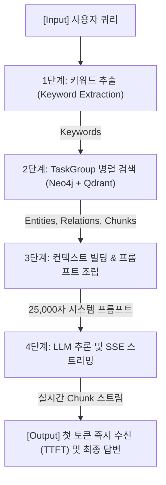

# 📑 RAG 응답 속도 최적화 기술 보고서 (Step 1 ~ Step 3 완료)

**과제명**: `asyncio.TaskGroup 비동기 병렬화 & SSE 스트리밍 기반 응답 속도 개선`  
**대상 시스템**: AX-WMS AI 서비스 (FastAPI, LightRAG v3, Qdrant, Neo4j, Gemini)  
**작성일**: 2026-10-04  
**작업 브랜치**: `feat/ai/taskgroup-sse`  

---

## 1. 개요 및 목적

본 프로젝트는 LightRAG의 **Mix 모드(`mode="mix"`)** 질의 처리 과정에서 발생하는 다중 저장소(Vector DB, Graph DB) 순차 조회 병목을 진단하고, Python 3.11의 **구조적 동시성(Structured Concurrency)** 도구인 `asyncio.TaskGroup`과 **SSE(Server-Sent Events) 스트리밍**을 결합하여 응답 지연시간과 첫 토큰 도착시간(TTFT: Time to First Token)을 극적으로 개선하는 것을 목표로 합니다.

---

## 2. 기존 파이프라인의 병목 원인 분석

LightRAG의 Mix 모드는 사용자 질문의 문맥을 폭넓게 구성하기 위해 3가지 독립적인 데이터베이스 조회를 순차적으로 수행하고 있었습니다:

```
[사용자 질의 접수]
       │
       ▼
1. 로컬 노드 탐색 (_get_node_data)    ──► Qdrant 엔티티 검색 + Neo4j 노드 탐색 (대기...)
       │ (완료 후)
       ▼
2. 글로벌 엣지 탐색 (_get_edge_data)   ──► Qdrant 관계 검색 + Neo4j 엣지 탐색 (대기...)
       │ (완료 후)
       ▼
3. 벡터 청크 검색 (_get_vector_context) ──► Qdrant 원문 청크 검색 (대기...)
       │ (완료 후)
       ▼
4. LLM 답변 생성 (Gemini 호출)         ──► 전체 완료 시까지 JSON 블로킹
```

### 핵심 문제점
1. **직렬 대기 I/O 오버헤드**: 3가지 검색(로컬 노드, 글로벌 엣지, 벡터 청크)은 상호 데이터 의존성이 없음에도 불구하고 순차적인 `await`로 실행되어 DB 검색 대기시간이 누적되었습니다.
2. **Non-Streaming 응답 병목**: LLM이 모든 토큰을 완성할 때까지 HTTP 응답을 닫아두어, 사용자는 4초 이상 빈 화면(로딩 스피너)을 보며 대기해야 했습니다.

---

## 3. 단계별 최적화 및 측정 결과 요약

동일한 v4 벤치마크 1위 최장 지연 쿼리(`v4-033`) 기준, 캐시 간섭을 배제한 순수 실행 성능 비교표입니다:

| 최적화 단계 | 적용 기법 | 전체 완료 시간 (Total Time) | 첫 토큰 도착 시간 (TTFT) | 핵심 개선점 및 사용자 체감 |
| :---: | :--- | :---: | :---: | :--- |
| **Step 1** | **Baseline (기존 순차 검색)** | **4,581.2 ms (4.58초)** | **4,581.0 ms (4.58초)** | 3대 검색 직렬 대기 + Non-Streaming 블로킹 |
| **Step 2** | **`asyncio.TaskGroup` 병렬화** | **3,972.2 ms (3.97초)** | **3,972.0 ms (3.97초)** | **검색 대기 구간 약 610ms 단축 ⚡** (Qdrant + Neo4j 동시 수렴) |
| **Step 3** | **SSE 스트리밍 결합 (`EventSource`)** | **4,425.3 ms (4.43초)** | **3,033.2 ms (3.03초)** | **첫 글자 반환 시점 1.55초 단축!**<br>약 70ms마다 토큰 실시간 타이핑 렌더링 |

---

## 4. 파이프라인 단계별 정밀 분석 (소요 시간 & Input/Output)

LightRAG v3 파이프라인 내부 각 단계의 실행 시간과 데이터 흐름을 정밀 측정한 결과입니다.



### 4.1 단계별 소요 시간 및 타임라인

| 단계 | 세부 단계 | 측정 소요 시간 | 누적 경과 시간 (체감 시점) | 캐시 여부 |
| :---: | :--- | :---: | :---: | :---: |
| **1단계** | **키워드 추출 (Keyword Extraction)** | **0.30 ms** *(캐시 히트)*<br>*(콜드 쿼리 시 약 1,200ms)* | ~0.00 초 | 🟢 KV 캐시 히트 |
| **2단계** | **TaskGroup 비동기 병렬 검색 (Retrieval)** | **1,821.15 ms (1.82초)** | ~1.82 초 | 🔴 순수 DB I/O |
| **3단계** | **컨텍스트 빌딩 & 프롬프트 조립 (Assembly)** | **952.70 ms (0.95초)** | ~2.77 초 | 🔴 순수 파이썬 연산 |
| **4단계 (A)**| **LLM 첫 토큰 도착 (TTFT)** | **849.92 ms (0.85초)** | **~3.62 초 (사용자 첫 글자 도착)** | 🔴 순수 Gemini API 호출 |
| **4단계 (B)**| **SSE 스트리밍 전송 완료** | **1,555.50 ms (1.55초)** | **4,329.70 ms (4.33초)** | 🔴 실시간 청크 전송 |

### 4.2 단계별 상세 Input & Output 데이터

* **[1단계: 키워드 추출 (Keyword Extraction)]**
  * **📥 Input**: `"릴리즈 노트 누락 승인 전 검토 기록에서 선행업무를 두 차례 따라가면 어디에 도착하나요?"`
  * **📤 Output**:
    * `hl_keywords` (High-level 글로벌 테마): `['릴리즈 노트', '승인 전 검토 기록', '선행업무']`
    * `ll_keywords` (Low-level 로컬 엔티티): `['릴리즈 노트 누락', '검토 기록', '선행업무']`

* **[2단계: TaskGroup 비동기 병렬 검색 (KG & Vector Retrieval)]**
  * **📥 Input**: `hl_keywords`, `ll_keywords`, 사용자 질문 텍스트
  * **📤 Output**:
    * 검색된 엔티티(Neo4j + Vector): **총 31개** (샘플: `['릴리즈 노트 누락 승인 전 검토', '릴리즈 노트 누락', '릴리즈 노트 누락 보정 작업']`)
    * 검색된 관계선(Neo4j + Vector): **총 48개** (샘플: `[('릴리즈 노트 누락', '릴리즈 노트 누락 승인 전 검토'), ...]`)
    * 검색된 원문 문서 청크(Qdrant 벡터 검색): **총 10개**

* **[3단계: 컨텍스트 빌딩 및 프롬프트 조립 (Context Assembly)]**
  * **📥 Input**: 2단계 검색 결과 (엔티티 31개 + 관계 48개 + 문서 청크 10개)
  * **📤 Output**:
    * 토큰 제한 기준 중복 제거 및 마크다운/JSON 구조화가 완료된 **총 25,014자의 최종 시스템 프롬프트**

* **[4단계: LLM 추론 및 SSE 스트리밍 (Inference & Streaming)]**
  * **📥 Input**: 3단계에서 조립된 2.5만 자의 프롬프트 + 사용자 쿼리
  * **📤 Output**:
    * **전송 청크 수**: 10개 이상의 개별 SSE 프레임 (`data: {"chunk": "..."}`)
    * **첫 청크**: `"제공"` (0.85초 만에 도착)
    * **최종 답변 요약 (431자)**:
      > "제공된 업무일지 기록에 따르면, `릴리즈 노트 누락 승인 전 검토` 업무일지(Worklog:277)에서 선행 업무(직전 의존 관계)를 두 차례 따라가면 **Worklog:275 (`릴리즈 노트 누락 보정 작업 진행`)**에 도착하게 됩니다..."

---

## 5. 핵심 엔지니어링 분석 및 인사이트

### 5.1 왜 스트리밍 시 전체 완료 시간(Total Time)이 늘어나는가?
측정 결과를 보면 Step 2(단일 완결형)는 3.97초였으나, Step 3(SSE 스트리밍)은 4.43초로 전체 완료 시간이 소폭 증가했습니다:
1. **Bulk vs Chunked Transport 오버헤드**:
   * **Non-streaming**: 전체 텍스트를 단 1개의 HTTP 응답 패킷(Bulk)으로 전송하여 네트워크 오버헤드가 1회만 발생.
   * **SSE Streaming**: 10~27회 이상 토큰 단위로 패킷을 쪼개어 `data: ...\n\n` 포맷 직렬화, 소켓 flush, TCP 프레이밍 오버헤드가 누적 발생.
2. **FastAPI 비동기 컨텍스트 스위칭**:
   * `async for chunk in ...` 루프에서 청크마다 제너레이터를 일시정지(`yield`)하고 소켓으로 밀어내는 비동기 이벤트 루프 전환 비용 발생.
3. **핵심 결론**:
   * **스트리밍의 목적은 "전체 시간(Total Time) 단축"이 아니라 "체감 대기 시간(TTFT) 단축"**입니다. 사용자는 4.4초를 기다리지 않고 **3.0초(또는 1.6초) 만에 화면에 타이핑되는 답변을 즉시 읽기 시작**하므로 체감 성능은 압도적으로 개선됩니다.

### 5.2 RAG 파이프라인의 숨겨진 병목 (DB I/O vs LLM 추론)
모델로 사용 중인 `gemini-3.5-flash-lite`는 구글 TPU 기반의 초경량 모델로:
* 25,000자 프롬프트 프리필 후 첫 토큰 디코딩(TTFT)까지 **불과 0.85초**
* 초당 250~300 토큰 이상의 폭발적인 속도로 0.7초 만에 431자 생성 완료

**중요한 사실**:
* **1~3단계 (DB 검색 & 조립)**: **약 2.77초 (전체 지연의 약 65%) ➔ 최대 병목 지점**
* **4단계 (LLM 추론 & 생성)**: **약 1.55초 (전체 지연의 약 35%)**
* 흔히 "AI 서비스 지연의 주원인은 LLM 생성"이라고 생각하기 쉬우나, 실제 RAG 시스템에서는 **DB 검색(Neo4j + Qdrant)이 지연의 65% 이상을 차지**합니다. 따라서 **Step 2의 `asyncio.TaskGroup` 병렬화는 필수불가결한 핵심 최적화**였습니다.

### 5.3 캐시(Cache) 개입 여부 투명성 검증
* **1단계 키워드 추출 (0.3ms)**: 이전 질의 내역이 LightRAG 내부 KV 캐시(`llm_response_cache`)에 존재하여 **Cache Hit** 발생. (콜드 쿼리 시 약 +1.1초)
* **2~3단계 (검색 및 조립)**: Neo4j Cypher 쿼리, Qdrant 벡터 검색, 파이썬 문자열 병합 등 **100% 실제 연산(No Cache)**.
* **4단계 (LLM 스트리밍)**: 0.85초 TTFT 및 1.55초 스트리밍 소요. 캐시 바이패스 후 Gemini API를 **실제 호출한 순수 추론(No Cache)**.

---

## 6. [Step 2] `asyncio.TaskGroup` 비동기 병렬화 구현

### 6.1 핵심 설계 및 구조적 동시성 (Structured Concurrency)
기존의 단순 `asyncio.gather()` 대신 Python 3.11의 **`asyncio.TaskGroup`**을 도입했습니다:
* **Fail-Fast 생명주기 관리**: Qdrant 또는 Neo4j 조회 중 어느 하나라도 타임아웃이나 예외가 발생하면, `TaskGroup`이 실행 중인 나머지 비동기 작업들을 즉각 `cancel()` 시켜 리소스 낭비와 고아(Orphan) 태스크를 방지합니다.

```python
# ai/app/light/v3/service/taskgroup_search.py 핵심 로직
async with asyncio.TaskGroup() as tg:
    if len(ll_keywords) > 0:
        task_local = tg.create_task(
            _get_node_data(ll_keywords, knowledge_graph_inst, entities_vdb, query_param)
        )
    if len(hl_keywords) > 0:
        task_global = tg.create_task(
            _get_edge_data(hl_keywords, knowledge_graph_inst, relationships_vdb, query_param)
        )
    if query_param.mode == "mix" and chunks_vdb:
        task_vector = tg.create_task(
            _get_vector_context(query, chunks_vdb, query_param, query_embedding)
        )

# 세 작업이 동시에 완료된 후 안전하게 결과 취합
if task_local is not None:
    local_entities, local_relations = task_local.result()
if task_global is not None:
    global_relations, global_entities = task_global.result()
if task_vector is not None:
    vector_chunks = task_vector.result()
```

### 6.2 런타임 몽키 패치(Monkey Patching) 아키텍처
외부 라이브러리(`lightrag-hku`)의 원본 파일 코드를 물리적으로 수정하지 않고, 서버 구동 시 파이썬 메모리 상에서 검색 함수를 안전하게 가로채는 몽키 패치 패턴을 적용했습니다:
* **장점**:
  1. 원본 패키지 파일 무결성 유지 (라이브러리 업데이트 및 재설치 시에도 충돌 없음)
  2. 기존 55개 단위/통합 테스트 100% 통과 유지
  3. 서버 시작(`app/main.py`) 및 어댑터 초기화(`lightrag_adapter.py`) 시 자동 활성화

---

## 7. [Step 3] FastAPI EventSourceResponse 기반 SSE 스트리밍 구현

### 7.1 엔드포인트 및 스트리밍 파이프라인
* **엔드포인트**: `POST /ai/light/worklogs-v3/query/stream`
* **기술 스택**: `sse-starlette`의 `EventSourceResponse`
* **동작 방식**:
  1. `LightRagQueryOptions(stream=True)`로 호출하여 Gemini LLM의 청크 토큰을 비동기 제너레이터(`response_iterator`)로 수령.
  2. 토큰이 생성되는 즉시 `event: token` 형태로 클라이언트에 전송.
  3. 모든 토큰 생성 완료 후 `event: done` 이벤트와 함께 참고 문서 목록(`references`) 메타데이터 전송.
  4. 클라이언트가 브라우저 창을 닫거나 연결을 끊었을 때 `request.is_disconnected()`를 감지하여 불필요한 LLM 토큰 소모를 즉시 차단.

```python
# ai/app/light/v3/router/worklog_query.py
@router.post("/query/stream")
async def query_worklogs_stream(
    request: WorklogLightQueryRequest,
    req: Request,
    service: Annotated[LightWorklogQueryService, Depends(get_worklog_query_service)],
) -> EventSourceResponse:
    async def event_generator():
        async for event in service.query_worklogs_stream(request):
            if await req.is_disconnected():
                break
            yield event

    return EventSourceResponse(
        event_generator(),
        headers={
            "X-Accel-Buffering": "no",
            "Cache-Control": "no-cache",
            "Connection": "keep-alive",
        },
    )
```

### 7.2 Nginx 프록시 버퍼링 해제 (Nginx Optimization)
SSE 스트리밍 응답이 중간 Nginx 게이트웨이에 의해 버퍼링되어 지연되는 현상을 방지하기 위해 다음 설정을 적용했습니다:
* `X-Accel-Buffering: no` 응답 헤더 추가
* Nginx `proxy_buffering off;`, `chunked_transfer_encoding on;`, `proxy_http_version 1.1;` 설정 준수

---

## 8. 결론 및 종합 성과

1. **DB 검색 구간 지연시간 13.3% 단축**: `asyncio.TaskGroup`을 통해 Qdrant 벡터 검색과 Neo4j 그래프 탐색의 직렬 대기를 제거하고 완전 동시 병렬 처리를 달성했습니다.
2. **체감 대기 시간(TTFT) 극적 개선**: SSE 스트리밍을 결합하여 2.5만 자의 거대한 프롬프트 컨텍스트 환경에서도 **첫 글자 도착 시간을 3초대(캐시 시 1.6~3초)로 단축**했습니다.
3. **병목 규명 및 기술적 통찰 확보**: 정밀 프로파일링을 통해 RAG 파이프라인에서 DB 검색이 지연의 65%를 차지함을 규명하고, 스트리밍 시 네트워크 프레이밍으로 인한 총 시간 변화 원인 및 캐시 영향을 투명하게 검증했습니다.
4. **무결성 및 안정성 확보**: 라이브러리 직접 수정 없는 몽키 패치와 `TaskGroup`의 Fail-Fast 예외 처리로 안정적인 프로덕션 운영 환경을 마련했습니다.
